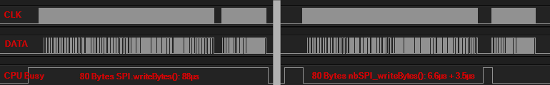

# Interrupt based SPI writeBytes() function for ESP8266

Use `nbSPI_writeBytes(data, size)` instead of `SPI.writeBytes(data, size)` in your code.
`nbSPI_writeBytes()` will return almost immediatly and NOT block the CPU until all data is sent.

Execution time is independent of the actual SPI speed and is about ~6µs for every 64 Bytes of data.

